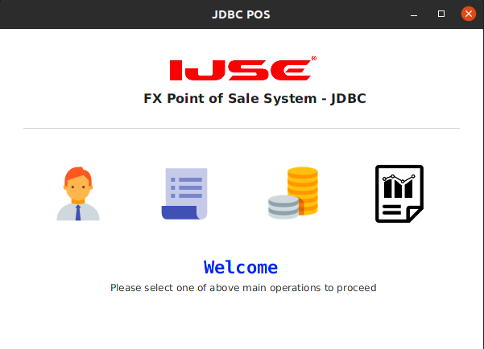
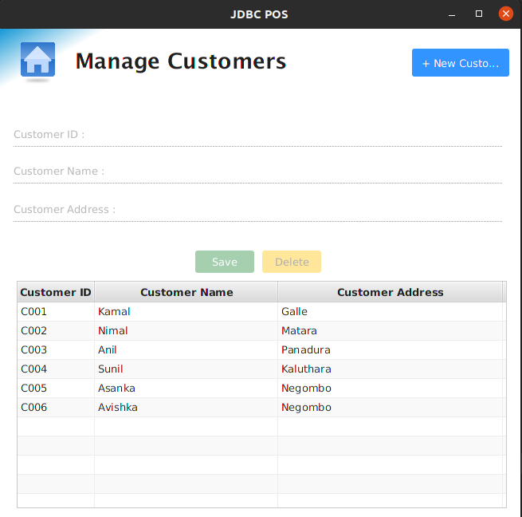
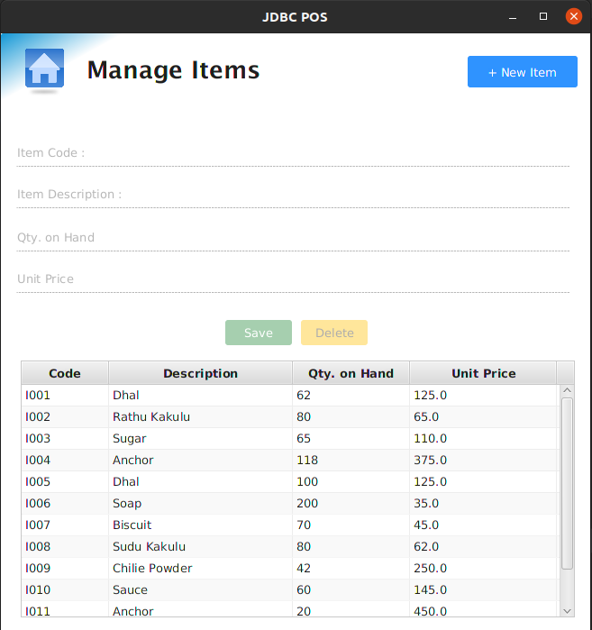
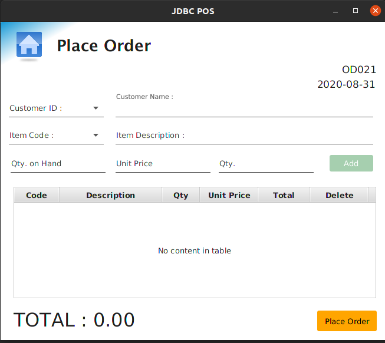
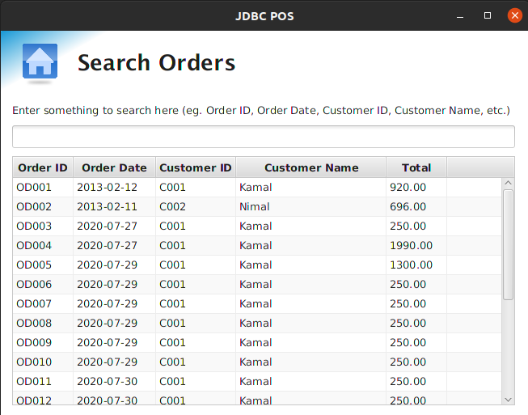

# POS System With Layered Architecture

## Introduction

In this **POS System** has all the functionalities of a POS system, like user customer adding,item management,
order placing,order viewing and order searching.It consists of five main parts;

    * Manage customers
    * Manage items
    * Placeorders
    * View orders
    * Search orders
    
This system has developed by using Java, JDBC and MySQL under the Layered Architecture.
     
Further this POS System has implemented by using various technologies and frameworks.Click the above link to check those implementations.

[Different Implementations of POS System](https://github.com/LawrenceAsanka/Point-of-Sale-System/blob/master/README.md)

#### Login

#### Customer Management

#### Item Management

#### Place Order

#### Search Order

## Prerequisites

* Before use this application you must need to install [JAVA](https://www.oracle.com/java/technologies/javase/javase-jdk8-downloads.html) runtime environment and 
[MYSQL](https://www.mysql.com/) database management services.

## Libraries

* [JFoenix](http://www.jfoenix.com/) - is an open source Java library, that implements Google Material Design using Java components.
* [MySQL Connector](https://dev.mysql.com/downloads/connector/j/) - MySQL Connector/J is the official JDBC driver for MySQL.

## Contributing

Pull requests are welcome. For major changes, please open an issue first to discuss what you would like to change.
Please make sure to update tests as appropriate.

## License

Distributed under the MIT License. See [License](LICENSE) for more information.
